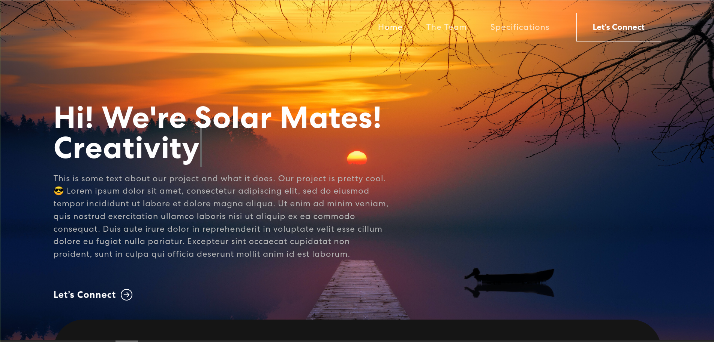

# MTE 481 Project Website in React

This project was bootstrapped with [Create React App](https://github.com/facebook/create-react-app).

Built using:

- Front-end library: React
- CSS framework: React-bootstrap
- CSS animations library: Animate.css

Built by:

- Keshav Pandey
- Noah Gillespie-Friesen
- Parizeh Asaf Rahman
- George Xiao